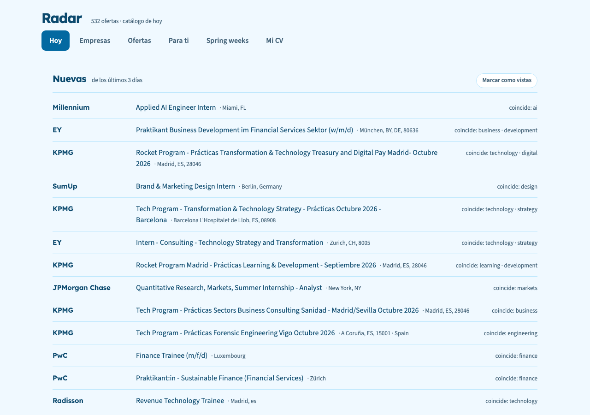
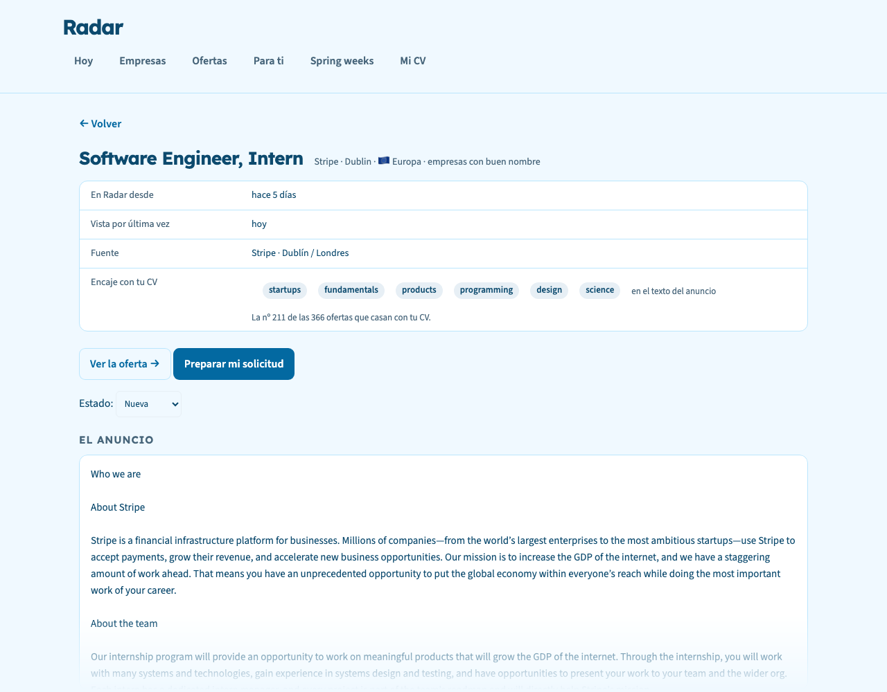
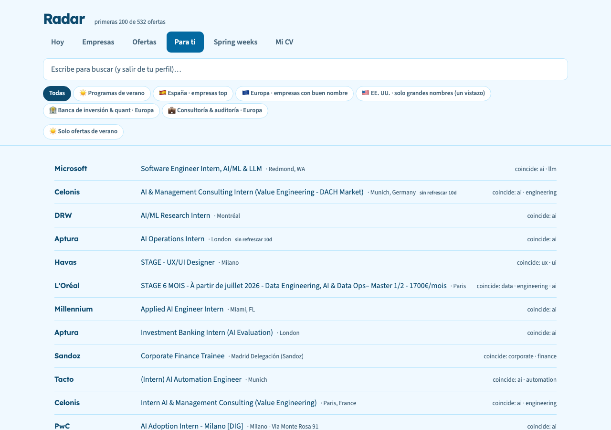

# Radar

A local internship board that fills itself every night, ranks openings against
your CV, and never asks you for an API key.

Radar scrapes the **public job APIs of the ATS platforms companies already use**
(Greenhouse, Lever, Ashby, Workday, SmartRecruiters, Workable, Recruitee,
Teamtailor, SuccessFactors, Avature, plus Amazon and JP Morgan), stores
everything in a SQLite file next to the code, and serves it from
`http://127.0.0.1:8000` with Python's standard library. No account, no cloud, no
`pip install`.



> The interface is in Spanish, and so are the code comments — it was built for
> its author first. The sources and the config are not: regions go from `es` to
> `us` and `latam`, and the filters are yours to set.

## Why

Internship listings live in a hundred career pages that each show you a
different slice, and job newsletters (this one included, at first) throw the
data away the moment the email is sent. There was no single list, no memory of
what had already been seen, and no way to ask *which of these actually match my
CV?*

Radar is that list, kept on your own disk.

## What it does

- **Fills itself.** `ingesta.py` walks 89 company boards plus the community
  GitHub boards. First run: roughly 500 openings from 110 companies in about
  five minutes. After that, a nightly pass at 02:30 keeps it current.
- **Ranks against your CV** with SQLite's FTS5 and `bm25()` — no model, no
  tokens, no network. Paste your CV once and the *Para ti* ("For you") tab is
  ordered by how well each opening matches it, showing which terms hit.
- **Reads the posting for you.** `descr.py` pulls the actual job description
  (ATS API when there is one, the Greenhouse iframe hidden behind a company
  page, or the `JobPosting` JSON-LD Google requires) so you can judge a role
  without leaving the app. Around three out of four openings carry their text;
  the ones that can't be read say so, with the reason.
- **Tells you what is new** since your last visit, and what has gone stale —
  an opening whose source stops confirming it gets flagged instead of quietly
  rotting in the list.
- **Prepares the application.** One button builds a prompt with the posting and
  your CV inside; you paste it into Claude (or anything else) and get back a
  tailored CV, the requirements you don't cover, and a cover letter.



## Install

**macOS** — clone it and double-click `instalar.command`. It checks your Python,
writes the launchd agents from the templates in `launchd/`, loads them, and
opens the app. From then on Radar is just a bookmark: the server comes up at
login and the catalogue refreshes overnight.

```bash
git clone https://github.com/nachoie123/radar.git
cd radar
chmod +x instalar.command   # first time only
./instalar.command
```

**Linux / Windows** — no launchd, so the two commands are yours to schedule:

```bash
python3 ingesta.py   # fills the catalogue (~5 min the first time)
python3 app.py       # serves http://localhost:8000
```

**Requirements:** Python 3.9 or newer (developed on 3.12) with SQLite compiled
with FTS5 — that's the whole list. `certifi` is used if it happens to be
installed; on macOS, a fresh python.org install trusts no certificate authority
at all, and the installer stops and tells you how to fix that before it becomes
89 sources failing at once at 2 in the morning.

## Configure it for you

Copy `config.example.json` to `config.json` and edit it. The example *is* the
default, so Radar works before you write anything:

```jsonc
{
  "grad_year": 2030,          // postings that demand an earlier class are dropped
  "solo_verano": true,        // summer internships only
  "solo_grado": true,         // drop the ones that require a master's or a PhD
  "necesito_visado_us": true, // drop US roles that need work authorization
  "regiones": ["es", "uk", "de", "fr", "benelux", "remoto"],
  "empresas_top_extra": ["Revolut", "Figma"]
}
```

Regions are pieces, not one block: `es`, `pt`, `uk`, `ie`, `de`, `fr`, `it`,
`pl`, `benelux`, `alpes`, `nordicos`, `europa`, `remoto`, `us`, `latam`. Someone
looking in London doesn't want Warsaw, and someone in the US wants neither.



## The application prompt

Radar does not call a model and does not want your API key. *Preparar mi
solicitud* ("Prepare my application") assembles the text and gets out of the
way:

```text
Quiero presentarme a esta oferta. Adapta mi CV a ella y prepárame las
respuestas del formulario, sin inventarte NADA que no esté en mi CV.
...
- No añadas ni una habilidad, empresa, fecha, nota o título que no esté en mi
  CV. Si piden algo que no tengo, va en el punto 2 y no en el 1.
- Lo que haga falta y no esté en el CV, déjalo escrito como [COMPLETAR].
  Prefiero un hueco a un dato inventado.

## LA OFERTA
Empresa: Stripe
Puesto: Software Engineer, Intern
Ubicación: Dublin
Enlace: https://stripe.com/jobs/listing/...

## EL ANUNCIO
[el texto completo de la oferta]

## MI CV
[tu CV]
```

When the posting text couldn't be read, the prompt says so with the link in
front of it — "I don't have it" and "there is nothing to read" are different
things for whoever is about to trust the answer.

## How it is put together

Four files, all standard library:

| File | What it is |
|---|---|
| `ingesta.py` | The scrapers, the filters and the source list. Writes through `db.upsert()` and nothing else. |
| `descr.py` | Fetches the posting text, one pass a night, with its own budget and watchdog. |
| `db.py` | Every SQL statement in the project. FTS5 lives inside `search()`. |
| `app.py` + `index.html` | A `ThreadingHTTPServer` and one HTML file. |

**What the server exposes.** It listens on `127.0.0.1` always, and additionally
on your Tailscale address (`100.64.0.0/10`) when Tailscale is up, so the app
works from your own phone. Never on `0.0.0.0` — that would hand the catalogue,
and the CV in it, to anything on the same café Wi-Fi. Off the API routes it
serves exactly one file, `index.html`: the database, the config and the logs
live in that same folder, and a static handler pointed at a directory will hand
them over if you let it.

Utilities: `probe.py` (checks which boards are alive and worth adding),
`dupes.py` (duplicate report), `backfill_loc.py` (recovers locations for rows
already stored).

Each of the four answers `--check` and runs its own tests, no framework, no
network:

```bash
python3 db.py --check && python3 app.py --check && python3 descr.py --check && python3 ingesta.py --check
```

## What it deliberately doesn't do

- **No accounts, no hosting, no payment.** One user, one machine, one SQLite
  file. The schema carries a `user_id` from day one so that stays *possible*,
  not so it happens.
- **No LinkedIn or Indeed scraping.** Public ATS endpoints exist to be consumed;
  those two are a lawsuit with a scraper attached. Radar links to the original
  posting instead of republishing it.
- **No automatic form filling.** Workday breaks selectors faster than anyone can
  maintain them. You get the answers prepared; you paste them.
- Some boards can't be read at all — `amazon.jobs` renders the posting with
  JavaScript, so those 40-odd openings arrive as a title and a link. They are
  marked once and not retried forever.

## License

MIT — see [LICENSE](LICENSE).
